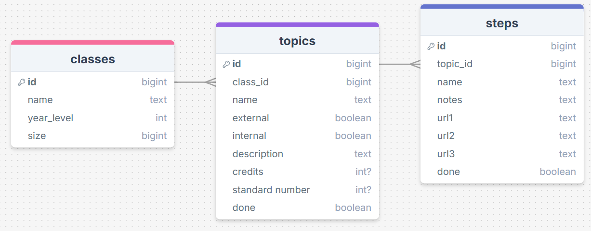
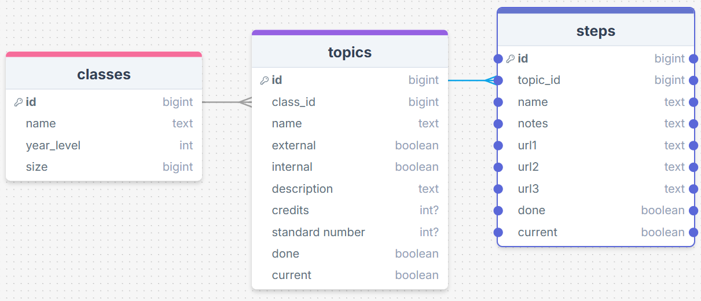

# Sprint 1 - A Working UI Prototype

## Sprint Goals

Develop a prototype that simulates the key functionality of the system, then test and refine it so that it can serve as the model for the next phase of development in Sprint 2.

[Figma](https://www.figma.com/) is used to develop the prototype.

---

## Initial Database Design

database will have 3 tables, one for classes, one for topics with the class as a separate key, and one for assignments with the topic and class as separate keys

---

## UI 'Flow'

The first stage of prototyping was to explore how the UI might 'flow' between states, based on the required functionality.

This Figma demo shows the initial design for the UI 'flow':

<iframe style="border: 20px solid rgba(255, 0, 0, 1);" width="800" height="450" src="https://embed.figma.com/proto/GGcGF0vmZpXDY5VRG9OAQv/Course-Planner?node-id=1-1858&p=f&scaling=min-zoom&content-scaling=fixed&page-id=0%3A1&starting-point-node-id=1%3A1858&embed-host=share" allowfullscreen></iframe>

### Testing

My end user gave me this feedback

> Generalise to be steps rather than assignments

> Due date not needed

> Fields: title, notes, url1/2/3

> Possibly to have a done field

> Visually show done steps and possibly fully done topics (e.g. greyed out)

I changed all the assignments to steps, I removed the due date, and I added several url columns to the steps table, and added a done column to the topics and steps table

### Changes / Improvements

<iframe style="border: 1px solid rgba(0, 0, 0, 0.1);" width="800" height="450" src="https://embed.figma.com/design/GGcGF0vmZpXDY5VRG9OAQv/Course-Planner?node-id=0-1&embed-host=share" allowfullscreen></iframe>

I then showed it back to Mr. Copley and he gave me some more feedback.

> Anything you can do to minimize clicks would be good... For example, on the class overview page showing the current topic/step for each class would mean I could see at a glance what I was up to...

to do this I added a current column to topics and steps in drawsql, and added it onto each individual class from the classes overview in the Figma prototype.

<iframe style="border: 1px solid rgba(0, 0, 0, 0.1);" width="800" height="450" src="https://embed.figma.com/design/GGcGF0vmZpXDY5VRG9OAQv/Course-Planner?node-id=0-1&embed-host=share" allowfullscreen></iframe>

---

## Refined UI Prototype

Having established the layout of the UI screens, the prototype was refined visually, in terms of colour, fonts, etc.

This Figma demo shows the UI with refinements applied:

https://www.figma.com/design/GGcGF0vmZpXDY5VRG9OAQv/Course-Planner?node-id=0-1&t=1cBkf64hWoRsUBji-1

---

## Sprint Review

This sprint has moved the project forward by giving me a blueprint that I can refer to in development of the project.

