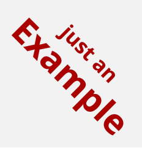
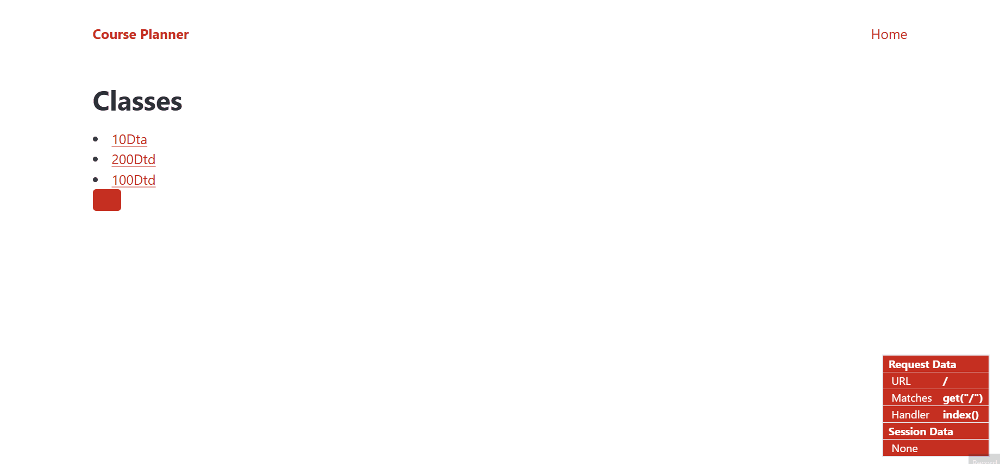

# Sprint 2 - A Minimum Viable Product (MVP)

## Sprint Goals

Develop a bare-bones, working web application that provides the key functionality of the system, then test and refine it so that it can serve as the basis for the final phase of development in Sprint 3.

---

## Implemented Database Schema

3 tables, classes, topics and steps, with many steps to a topic and many topics to a class.

---

## Initial Implementation

The key functionality of the web app was implemented:

---

## Testing newClassForm page

For the minimun viable product i simply wanted to get the page working. At first there were some struggles with routing it correctly, as it is rather finicky with all the forward slashes you need, but after some trial and error I figured out how to do it. Then after the page was usable I attempted to add a new class, to which it did not add a new class, but put the classAdd route in the link, doing nothing. I then took a closer look at my code and figured out the problem. It was addClass in init.py and classAdd in newClassForm. After making them match... it works!

[classAdd](screenshots/classAdd.png)

[addClass](screenshots/addClass.png)

### Changes / Improvements

Replace this text with notes any improvements you made as a result of the testing.

**PLACE SCREENSHOTS AND/OR ANIMATED GIFS OF THE IMPROVED SYSTEM HERE**

---

## Testing FEATURE NAME HERE

Replace this text with notes about what you are testing, how you tested it, and the outcome of the testing

**PLACE SCREENSHOTS AND/OR ANIMATED GIFS OF THE TESTING HERE**

### Changes / Improvements

Replace this text with notes any improvements you made as a result of the testing.

**PLACE SCREENSHOTS AND/OR ANIMATED GIFS OF THE IMPROVED SYSTEM HERE**

---

## Testing FEATURE NAME HERE

Replace this text with notes about what you are testing, how you tested it, and the outcome of the testing

**PLACE SCREENSHOTS AND/OR ANIMATED GIFS OF THE TESTING HERE**

### Changes / Improvements

Replace this text with notes any improvements you made as a result of the testing.

**PLACE SCREENSHOTS AND/OR ANIMATED GIFS OF THE IMPROVED SYSTEM HERE**

---

## Testing FEATURE NAME HERE

Replace this text with notes about what you are testing, how you tested it, and the outcome of the testing

**PLACE SCREENSHOTS AND/OR ANIMATED GIFS OF THE TESTING HERE**

### Changes / Improvements

Replace this text with notes any improvements you made as a result of the testing.

**PLACE SCREENSHOTS AND/OR ANIMATED GIFS OF THE IMPROVED SYSTEM HERE**

---

## Testing FEATURE NAME HERE

Replace this text with notes about what you are testing, how you tested it, and the outcome of the testing

**PLACE SCREENSHOTS AND/OR ANIMATED GIFS OF THE TESTING HERE**

### Changes / Improvements

Replace this text with notes any improvements you made as a result of the testing.

**PLACE SCREENSHOTS AND/OR ANIMATED GIFS OF THE IMPROVED SYSTEM HERE**

---

## Sprint Review

Replace this text with a statement about how the sprint has moved the project forward - key success point, any things that didn't go so well, etc.

