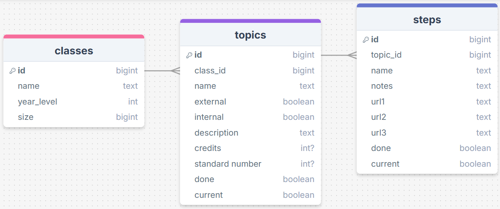
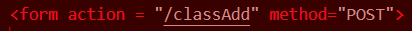
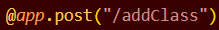
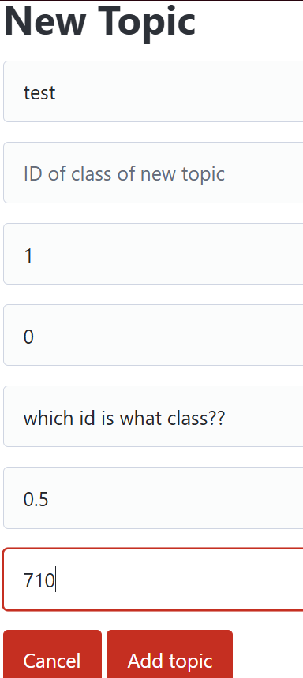
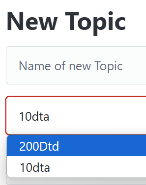
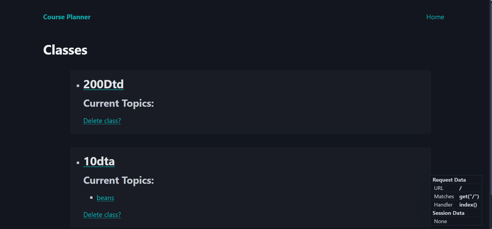
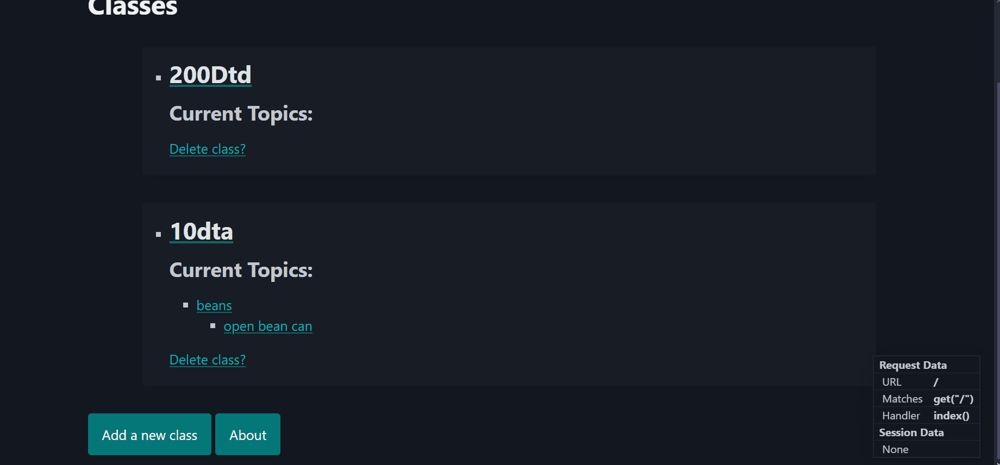

# Sprint 2 - A Minimum Viable Product (MVP)

## Sprint Goals

Develop a bare-bones, working web application that provides the key functionality of the system, then test and refine it so that it can serve as the basis for the final phase of development in Sprint 3.

---

## Implemented Database Schema

3 tables, classes, topics and steps, with many steps to a topic and many topics to a class.

---

## Initial Implementation

The key functionality of the web app was implemented:

---

## Testing newClassForm page

For the minimun viable product i simply wanted to get the page working. At first there were some struggles with routing it correctly, as it is rather finicky with all the forward slashes you need, but after some trial and error I figured out how to do it. Then after the page was usable I attempted to add a new class, to which it did not add a new class, but put the classAdd route in the link, doing nothing. I then took a closer look at my code and figured out the problem. It was addClass in init.py and classAdd in newClassForm. After making them match... it works!

### Changes / Improvements

Replace this text with notes any improvements you made as a result of the testing.

**PLACE SCREENSHOTS AND/OR ANIMATED GIFS OF THE IMPROVED SYSTEM HERE**

---

## Testing newTopicForm

It was simple enough to get the page and form working, however there was no way to indicate which class id corresponded to which class name, which was annoying. The same problem also arose with the newStepForm

### Changes / Improvements

Instead of using an input tag, I used a select tag with the value being the id of the class, and the option being the name of the class. This makes it a lot more intuitive to use

I also used the same method for the new Step form page

---

## Testing current topic/step feature

Having a Topic/Step with current = 1 means that it will appear under the "current topic/step" section, and appear underneath its class on the homepage. I will be testing to see if the python can change a topic/step's current between 1 and 0.

### Changes / Improvements

Works as intended.

---

## Sprint Review

This sprint has moved the project forwards as we now have a working system which does what we intend. Most of the problems I encountered were simple errors with simple fixes, like forward slashes in routes, capitalization, and SQL query mishaps. But past all that, we are looking good.

