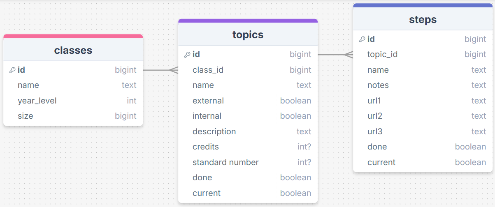
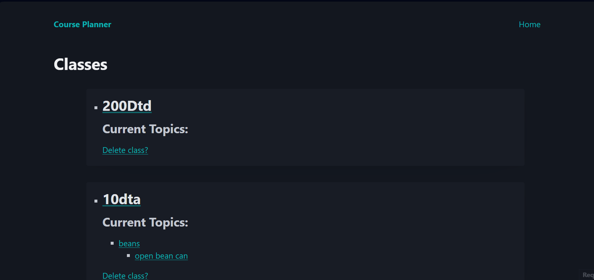
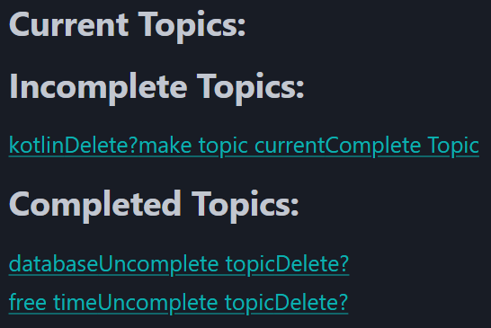
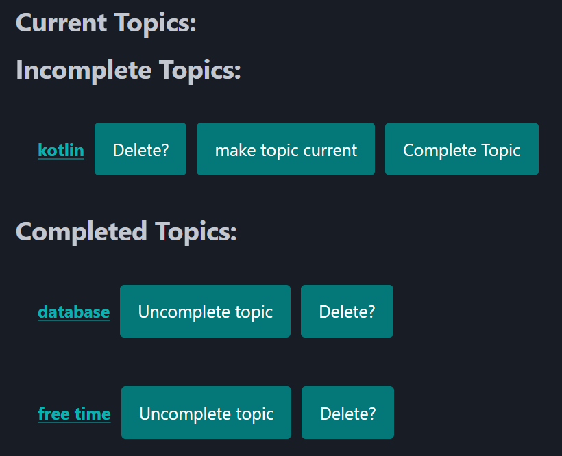

# Sprint 3 - A Refined and Complete System

## Sprint Goals

Develop the system until it is fully featured, with a refined UI and it satisfies the requirements. The system will be fully tested at this point.

---

## Updated Database Schema (if it changed)

Nothing has changed regarding the database schema

---

## Final Implementation

The web app is fully implemented with a refined UI:

---

## Testing links of topics/steps in class/topic page

Right now, this looks really ugly and is hard to use.

### Changes / Improvements

It was a simple fix, I changed them all the options to buttons with role="button" in the a tag, and kept the link to the actual topic as not a button, but made it strong (bold). i also added a bit of padding between the links and aligned them vertically.

---

## Sprint Review

This sprint moved the project forward by making the UI look nice and making increasing overall accessibility by making it easier to use. I encountered minor trouble in this sprint by not ending up with much time to work on it, but at least it works as intended.

